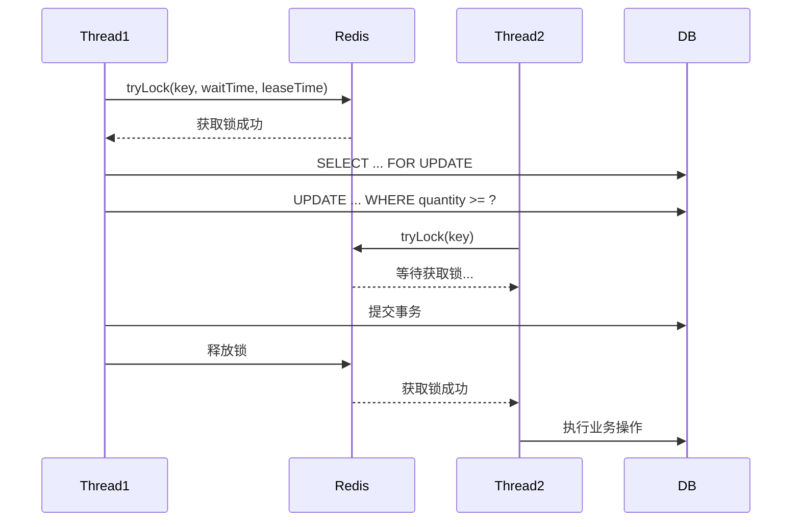
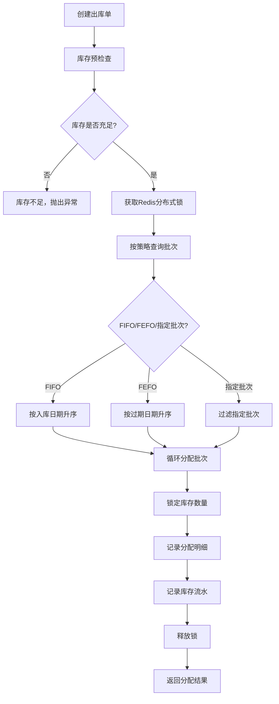

# 智慧仓储管理系统 (WMS)

一个功能完整的智慧仓储管理系统，采用前后端分离架构，覆盖仓储全业务流程。

## 📋 项目简介

本系统是一个企业级智慧仓储管理系统，实现了从供应商到货、入库质检、库位管理、库存管控、订单拣货、出库复核到退货入库、盘点管理的全业务流程闭环。系统支持多批次管理、先进先出、效期优先、库存预警等专业仓储功能。

## 🛠️ 技术栈

### 后端技术栈
| 技术 | 版本 | 说明 |
|------|------|------|
| Java | 1.8 | 开发语言 |
| Spring Boot | 2.7.18 | 应用框架 |
| MyBatis | 2.3.2 | ORM框架 |
| MySQL | 8.0 | 关系型数据库 |
| Redis | 5.0+ | 缓存&分布式锁 |
| Redisson | 3.23.5 | 分布式锁实现 |
| Druid | 1.2.20 | 数据库连接池 |
| Knife4j | 4.3.0 | API文档 |
| PageHelper | 1.4.7 | 分页插件 |
| Hutool | 5.8.23 | 工具类库 |

### 前端技术栈
| 技术 | 版本 | 说明 |
|------|------|------|
| Vue | 3.4.x | 前端框架 |
| Vue Router | 4.x | 路由管理 |
| Pinia | 2.x | 状态管理 |
| Element Plus | 2.4.x | UI组件库 |
| ECharts | 5.4.x | 图表库 |
| Axios | 1.6.x | HTTP客户端 |
| Vite | 5.x | 构建工具 |
| Sass | 1.69.x | CSS预处理器 |
| Day.js | 1.11.x | 日期处理 |

## 📁 项目结构

```
wms/
├── backend/                    # 后端项目
│   ├── src/
│   │   ├── main/
│   │   │   ├── java/com/wms/
│   │   │   │   ├── common/     # 通用组件（Result、枚举、分页）
│   │   │   │   ├── config/     # 配置类（Redis、事务、Swagger）
│   │   │   │   ├── controller/ # Controller层
│   │   │   │   ├── dto/        # 数据传输对象
│   │   │   │   ├── entity/     # 实体类
│   │   │   │   ├── exception/  # 异常处理
│   │   │   │   ├── init/       # 初始化数据
│   │   │   │   ├── lock/       # 分布式锁
│   │   │   │   ├── mapper/     # MyBatis Mapper
│   │   │   │   ├── service/    # Service层
│   │   │   │   │   └── impl/   # Service实现
│   │   │   │   ├── statemachine/ # 库存状态机
│   │   │   │   └── WmsApplication.java
│   │   │   └── resources/
│   │   │       ├── mapper/     # MyBatis XML映射
│   │   │       ├── sql/        # SQL脚本
│   │   │       ├── application.yml
│   │   │       └── logback-spring.xml
│   │   └── test/               # 单元测试
│   └── pom.xml
├── frontend/                   # 前端项目
│   ├── src/
│   │   ├── api/                # API接口
│   │   ├── layout/             # 布局组件
│   │   ├── router/             # 路由配置
│   │   ├── store/              # Pinia状态管理
│   │   ├── styles/             # 全局样式
│   │   ├── utils/              # 工具函数
│   │   ├── views/              # 页面组件
│   │   ├── App.vue
│   │   └── main.js
│   ├── index.html
│   ├── package.json
│   └── vite.config.js
├── .gitignore
├── README.md
└── 联调说明.md
```

## ✨ 功能特性

### 业务功能覆盖

| 模块 | 功能说明 |
|------|----------|
| **供应商到货** | 采购入库单创建、供应商送货确认 |
| **入库质检** | 质检流程、合格/不合格处理、质检报告 |
| **库位分配** | 自动推荐库位、手动分配、容量检查 |
| **批次库存** | 多批次管理、批次属性、批次追踪 |
| **效期管理** | 生产日期、过期日期、临期预警、自动过期 |
| **库存冻结** | 质量冻结、盘点冻结、解冻流程 |
| **订单拣货** | 波次拣货、扫码拣货、异常处理 |
| **出库复核** | 二次复核、数量确认、差异处理 |
| **退货入库** | 退货申请、质检、重新入库 |
| **盘点差异** | 周期盘点、盲盘、盘盈盘亏处理 |
| **库存预警** | 效期预警、库存上下限预警、预警看板 |

### 核心业务规则

1. **同一商品多批次**：支持同一商品在不同库位存在多个批次，独立管理
2. **先进先出 (FIFO)**：按入库日期排序，优先出库最早入库的批次
3. **效期优先 (FEFO)**：按过期日期排序，优先出库即将过期的批次
4. **库位容量检查**：入库前自动检查库位可用容量，防止超容
5. **库存并发扣减**：Redis分布式锁 + 数据库行锁 + 乐观锁，三重保证
6. **重复拣货防护**：库存锁定机制，防止同一库存被多次拣货
7. **出库撤销**：完整的回滚机制，撤销后自动释放库存锁定
8. **盘点盘盈盘亏**：差异审批后自动调整库存，记录库存流水
9. **批次追踪**：完整记录批次从入库到出库的全链路流转

### 前端页面

| 页面 | 功能说明 |
|------|----------|
| **仓库库位视图** | 可视化库位矩阵、状态颜色编码、库位详情、批次查询 |
| **入库流程** | 入库单管理、到货确认、质检处理、库位分配、上架确认 |
| **拣货任务** | 波次管理、拣货任务列表、扫码拣货、进度跟踪 |
| **批次明细** | 批次列表、多条件筛选、效期倒计时、批次追踪 |
| **库存流水** | 完整操作记录、多维度查询、出入库趋势图 |
| **预警看板** | 预警统计、类型分布、趋势分析、预警处理 |
| **统计报表** | 入库统计、出库统计、库存周转、库位利用率 |

## 🚀 快速开始

### 环境要求

- JDK 1.8+
- Maven 3.6+
- MySQL 8.0+
- Redis 5.0+
- Node.js 16+
- npm 8+

### 数据库初始化

1. 创建数据库
```sql
CREATE DATABASE wms DEFAULT CHARACTER SET utf8mb4 COLLATE utf8mb4_general_ci;
```

2. 执行初始化脚本
```bash
mysql -u root -p wms < backend/src/main/resources/sql/wms_init.sql
```

### 后端启动

1. 修改数据库和Redis配置
```yaml
# backend/src/main/resources/application.yml
spring:
  datasource:
    url: jdbc:mysql://localhost:3306/wms?useUnicode=true&characterEncoding=utf8&useSSL=false&serverTimezone=Asia/Shanghai
    username: root
    password: your_password
  data:
    redis:
      host: localhost
      port: 6379
      password: your_redis_password
```

2. 启动应用
```bash
cd backend
mvn clean compile
mvn spring-boot:run
```

3. 验证启动
- API文档: http://localhost:8080/api/doc.html
- 健康检查: http://localhost:8080/api/health

### 前端启动

1. 安装依赖
```bash
cd frontend
npm install
```

2. 启动开发服务器
```bash
npm run dev
```

3. 访问应用
- 前端地址: http://localhost:5173

### 测试账号

| 用户名 | 密码 | 角色 | 说明 |
|--------|------|------|------|
| admin | 123456 | 系统管理员 | 全部权限 |
| warehouse | 123456 | 仓库管理员 | 入库、出库、库位管理 |
| inspector | 123456 | 质检员 | 入库质检、退货质检 |
| picker | 123456 | 拣货员 | 拣货任务、出库复核 |
| manager | 123456 | 经理 | 盘点审批、报表查看 |

## 📊 核心架构设计

### 库存状态机

```
          ┌─────────────┐
          │   NORMAL    │ 正常库存
          └──────┬──────┘
                 │
         ┌───────┴───────┐
         ▼               ▼
    ┌─────────┐     ┌─────────┐
    │ LOCKED  │     │ FROZEN  │ 锁定/冻结
    └────┬────┘     └────┬────┘
         │                │
         └───────┬────────┘
                 │
         ┌───────┴───────┐
         ▼               ▼
    ┌─────────┐     ┌────────────┐
    │ EXPIRED │     │ NEAR_EXPIRE│ 过期/临期
    └─────────┘     └────────────┘
```

### 分布式锁机制



### 出库分配流程



## 🔒 安全设计

1. **密码安全**：MD5加密存储，测试账号密码均为 `123456`
2. **SQL注入防护**：MyBatis预编译SQL，禁止字符串拼接
3. **接口幂等性**：基于Redis的防重复提交
4. **操作审计**：所有库存变更记录流水，支持追溯
5. **权限控制**：基于用户角色的功能权限控制
6. **敏感数据**：日志中脱敏处理敏感信息

## 📝 API文档

启动后端服务后访问：
- **Knife4j UI**: http://localhost:8080/api/doc.html
- **Swagger JSON**: http://localhost:8080/api/v2/api-docs

主要API模块：
- `/api/auth/*` - 认证接口
- `/api/inventory/*` - 库存管理
- `/api/receipt/*` - 入库管理
- `/api/shipment/*` - 出库管理
- `/api/picking/*` - 拣货任务
- `/api/stocktake/*` - 盘点管理
- `/api/return/*` - 退货管理
- `/api/alert/*` - 预警管理

## 🧪 测试覆盖

### 单元测试

| 测试类 | 测试场景 |
|--------|----------|
| `InventoryStateMachineTest` | 状态流转、临期判断、异常场景 |
| `RedisLockTest` | 可重入锁、并发互斥、锁超时、异常释放 |
| `InventoryServiceTest` | 入库、出库、锁定、冻结、并发扣减 |
| `ReceiptOrderServiceTest` | 完整入库流程、质检、上架 |
| `ShipmentOrderServiceTest` | 完整出库流程、分配、撤销 |
| `StocktakeServiceTest` | 盘点流程、盘盈盘亏处理 |
| `UserServiceTest` | 登录认证、用户查询 |

### 运行测试

```bash
cd backend
mvn test
```

## 🔧 部署说明

### 后端部署

```bash
# 打包
mvn clean package -Dmaven.test.skip=true

# 运行
java -jar target/wms-1.0.0.jar --spring.profiles.active=prod
```

### 前端部署

```bash
# 构建
npm run build

# 部署dist目录到Nginx
```

### Nginx配置示例

```nginx
server {
    listen 80;
    server_name wms.example.com;

    location / {
        root /var/www/wms/dist;
        try_files $uri $uri/ /index.html;
    }

    location /api/ {
        proxy_pass http://localhost:8080/api/;
        proxy_set_header Host $host;
        proxy_set_header X-Real-IP $remote_addr;
    }
}
```

## ❓ 常见问题

### 1. 启动时数据库连接失败
- 检查MySQL服务是否启动
- 确认application.yml中的数据库配置正确
- 确认数据库用户权限

### 2. Redis连接失败
- 检查Redis服务是否启动
- 确认Redis密码配置
- 检查防火墙是否开放6379端口

### 3. 前端跨域问题
- 开发环境已配置Vite代理
- 生产环境配置Nginx反向代理

### 4. 初始化数据未生效
- 检查数据库中是否已有数据（有数据时自动跳过初始化）
- 可手动执行SQL脚本：`wms_init.sql`
- 查看启动日志中的初始化信息

### 5. 库存并发扣减测试失败
- 确保Redis服务正常运行
- 检查Redisson配置是否正确
- 确认数据库引擎为InnoDB（支持行锁）

## 📄 许可证

本项目仅供学习研究使用。

## 🤝 技术支持

如有问题，请参考 `联调说明.md` 文档，或查看各模块的详细注释。

---

**智慧仓储管理系统 © 2025**
