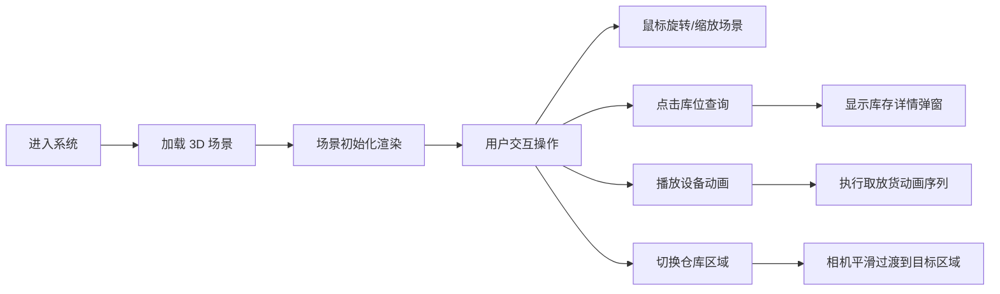

## 1. 产品概述

自动化立体仓库三维可视化展示系统，通过 Three.js 实现高保真 3D 场景还原，支持库存信息查询、设备动画演示、运行状态监控等功能，为物流仓储行业提供直观的数字化展示方案。

- 核心目标：以三维形式直观展示自动化立体仓库的运作流程和设备状态
- 目标用户：仓储管理人员、物流工程师、企业决策者、展厅参观者

## 2. 核心功能

### 2.1 用户角色

| 角色 | 登录方式 | 核心权限 |
|------|----------|----------|
| 访客 | 免登录 | 浏览场景、查看库存、播放动画、阅读教程 |

### 2.2 功能模块

1. **三维场景展示**：高还原度仓库场景、360° 旋转缩放、细节模型渲染
2. **库存信息查询**：点击库位查看库存详情、货箱信息、托盘状态
3. **设备动画演示**：堆垛机取放货动画、输送线运输动画、提升机运行动画
4. **区域切换功能**：入库区、存储区、出库区、拣选区快速切换
5. **路径可视化**：出入库作业路径高亮显示、设备运行轨迹
6. **设备状态监控**：实时显示设备运行状态、故障告警、统计数据
7. **运行教程**：交互式操作指南、功能介绍、模型结构说明

### 2.3 页面详情

| 页面名称 | 模块名称 | 功能描述 |
|----------|----------|----------|
| 主场景页 | 3D 渲染区域 | 仓库全景展示、鼠标交互控制、场景加载动画 |
| 主场景页 | 信息面板 | 库存统计、设备状态、库位利用率 ECharts 图表 |
| 主场景页 | 操作工具栏 | 视角重置、动画控制、区域切换、辅助开关 |
| 主场景页 | 库位弹窗 | 显示库位编号、货物信息、入库时间、数量、状态 |
| 教程面板 | 操作指南 | 鼠标键盘操作说明、功能按钮介绍 |
| 教程面板 | 模型说明 | 设备组成介绍、技术参数说明 |

## 3. 核心流程

## 4. 用户界面设计

### 4.1 设计风格

- **主色调**：工业蓝 `#165DFF`，代表科技与专业
- **辅助色**：警示橙 `#FF7D00`、成功绿 `#00B42A`、危险红 `#F53F3F`
- **背景色**：深灰 `#1D2129` 到 浅灰 `#4E5969` 渐变
- **按钮风格**：圆角 6px，悬停浮起效果，点击反馈
- **字体**：IBM Plex Mono（等宽数字）+ Noto Sans SC（中文）
- **布局风格**：沉浸式 3D 场景为主，悬浮式控制面板，半透明毛玻璃效果
- **图标风格**：线性图标，工业风格，统一 24px 尺寸

### 4.2 页面设计概述

| 页面名称 | 模块名称 | UI 元素 |
|----------|----------|---------|
| 主场景页 | 3D 视口 | 全屏渲染，环境光遮蔽，柔和阴影，光晕效果 |
| 主场景页 | 顶部状态栏 | 系统标题、实时时钟、连接状态、全屏按钮 |
| 主场景页 | 左侧工具栏 | 视角控制、动画播放、区域切换、标签显示 |
| 主场景页 | 右侧信息栏 | 库存统计饼图、设备状态列表、库位利用率柱状图 |
| 主场景页 | 底部控制条 | 时间轴、播放速度、循环模式、暂停/继续 |
| 弹窗组件 | 库位详情 | 卡片式布局，货物图片，信息表格，操作按钮 |

### 4.3 响应式设计

- **桌面端优先**：1920×1080 为基准设计，支持 2K/4K 自适应
- **平板适配**：工具栏垂直排列，信息面板可折叠
- **触控优化**：支持手势缩放、双指旋转、点击长按操作

### 4.4 3D 场景规范

**环境设置**
- 光照系统：主方向光模拟顶灯 + 环境光补光 + 货架区域射灯
- 阴影：PCFSoftShadowMap，512px 分辨率，适度柔和
- 背景：深空灰色渐变，轻微雾效营造空间感

**相机设置**
- 初始视角：45° 俯视，距离仓库中心 30 米
- 控制方式：OrbitControls，阻尼效果 0.05
- 限制范围：最小距离 5 米，最大距离 60 米，极角 10°-85°

**材质表现**
- 货架：金属质感，蓝色喷漆，轻微划痕纹理
- 设备：工业灰 + 品牌黄标识，塑料与金属结合
- 地面：环氧地坪，反射强度 0.3，标线清晰
- 货箱：瓦楞纸箱纹理，透明胶带，标签贴纸

**动画效果**
- 堆垛机：三段式动画（水平移动→垂直升降→货叉伸缩）
- 输送线：滚筒旋转，货物平移，皮带滚动
- 相机过渡：Tween.js 平滑动画，时长 800ms

**性能优化**
- 模型合并：相同材质几何体合并渲染
- 实例化：货架立柱、货箱使用 InstancedMesh
- LOD 分级：远距离简化模型
- 视锥体剔除：不可见对象不渲染
