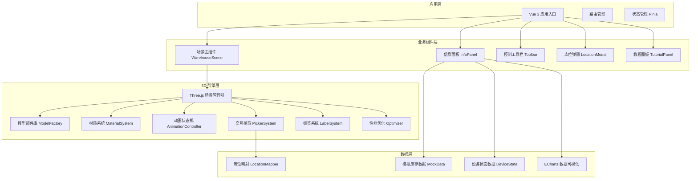

## 1. 架构设计



## 2. 技术栈说明

| 技术 | 版本 | 用途 |
|------|------|------|
| Vue | 3.4.x | 前端框架，Composition API |
| TypeScript | 5.4.x | 类型安全 |
| Vite | 5.2.x | 构建工具 |
| Three.js | 0.164.x | 3D 渲染引擎 |
| @tweenjs/tween.js | 23.1.x | 动画补间 |
| ECharts | 5.5.x | 数据可视化图表 |
| Pinia | 2.1.x | 状态管理 |
| Vue Router | 4.3.x | 路由管理 |
| SCSS | 1.77.x | 样式预处理器 |
| three.meshline | 3.2.x | 路径线条渲染 |

## 3. 目录结构

```
src/
├── assets/                 # 静态资源
│   ├── textures/          # 纹理图片
│   ├── fonts/             # 字体文件
│   └── styles/            # 全局样式
├── components/            # Vue 组件
│   ├── WarehouseScene.vue
│   ├── InfoPanel.vue
│   ├── Toolbar.vue
│   ├── LocationModal.vue
│   └── TutorialPanel.vue
├── three/                 # Three.js 核心模块
│   ├── core/              # 场景、相机、渲染器
│   ├── models/            # 模型部件库
│   ├── materials/         # 材质系统
│   ├── animation/         # 动画状态机
│   ├── interaction/       # 交互拾取
│   ├── labels/            # 标签系统
│   └── utils/             # 工具函数
├── store/                 # Pinia 状态
│   ├── useSceneStore.ts
│   ├── useInventoryStore.ts
│   └── useDeviceStore.ts
├── data/                  # 模拟数据
│   ├── inventory.ts
│   ├── locations.ts
│   └── devices.ts
├── types/                 # TypeScript 类型
│   ├── index.ts
│   ├── three.d.ts
│   └── inventory.d.ts
├── utils/                 # 工具函数
│   └── helpers.ts
├── App.vue
└── main.ts
```

## 4. 核心模块设计

### 4.1 模型部件库 (ModelFactory)

**职责**：创建各种设备和场景元素的 3D 模型

```typescript
// 货架模型 - 立柱、横梁、层板、护栏
createRack(rows: number, levels: number, bays: number): Group

// 堆垛机模型 - 行走机构、立柱、载货台、货叉
createStacker(id: string): Group

// 输送线模型 - 机架、滚筒、电机、侧边护栏
createConveyor(length: number): Group

// 提升机模型 - 井架、轿厢、配重、链条
createElevator(): Group

// 托盘模型 - 川字底、九脚、双面托盘
createPallet(type: PalletType): Group

// 货箱模型 - 瓦楞纸、胶带封口、标签
createBox(size: BoxSize, hasLabel: boolean): Group

// 扫码设备 - 扫描枪、显示屏、支架
createScanner(): Group

// 安全围栏 - 立柱、网片、门板
createFence(length: number): Group

// 控制柜 - 柜体、面板、按钮、显示屏
createCabinet(): Group
```

### 4.2 材质系统 (MaterialSystem)

**职责**：统一管理场景材质，支持主题切换

```typescript
class MaterialSystem {
  metalMaterial: MeshStandardMaterial
  plasticMaterial: MeshStandardMaterial
  woodMaterial: MeshStandardMaterial
  concreteMaterial: MeshStandardMaterial
  glassMaterial: MeshStandardMaterial
  
  getRackMaterial(): MeshStandardMaterial
  getBoxMaterial(color: number): MeshStandardMaterial
  getFloorMaterial(): MeshStandardMaterial
  getEmissiveMaterial(color: number): MeshStandardMaterial
}
```

### 4.3 动画状态机 (AnimationController)

**职责**：管理设备动画序列和状态转换

```typescript
enum AnimationState { IDLE, MOVING, LIFTING, FORKING, COMPLETE }

class AnimationController {
  currentState: AnimationState
  stacker: Stacker
  
  async moveToLocation(target: Location): Promise<void>
  async pickupCargo(): Promise<void>
  async placeCargo(): Promise<void>
  async playSequence(sequence: AnimationClip[]): Promise<void>
  pause(): void
  resume(): void
  stop(): void
}
```

### 4.4 库位数据映射 (LocationMapper)

**职责**：建立 3D 坐标与库位编号的映射关系

```typescript
interface LocationData {
  id: string
  row: number
  bay: number
  level: number
  position: Vector3
  occupied: boolean
  cargo?: CargoData
}

class LocationMapper {
  locations: Map<string, LocationData>
  
  getLocationById(id: string): LocationData | undefined
  getLocationByPosition(pos: Vector3): LocationData | undefined
  updateLocation(id: string, data: Partial<LocationData>): void
  getAvailableLocations(): LocationData[]
}
```

### 4.5 交互拾取系统 (PickerSystem)

**职责**：处理鼠标点击、悬停等交互事件

```typescript
class PickerSystem {
  raycaster: Raycaster
  mouse: Vector2
  
  onHover(intersects: Intersection[]): void
  onClick(intersects: Intersection[]): void
  highlightObject(object: Object3D): void
  unhighlightObject(): void
}
```

### 4.6 标签系统 (LabelSystem)

**职责**：管理场景中的 2D/3D 标签

```typescript
class LabelSystem {
  createLocationLabel(location: LocationData): CSS2DObject
  createDeviceStatusLabel(device: DeviceData): CSS2DObject
  createPathLabel(text: string, position: Vector3): CSS2DObject
  updateLabelPosition(): void
  setLabelVisibility(type: LabelType, visible: boolean): void
}
```

### 4.7 性能优化模块 (Optimizer)

**职责**：提升场景渲染性能

```typescript
class Optimizer {
  mergeGeometries(objects: Mesh[]): Mesh
  createInstancedMesh(geometry: BufferGeometry, material: Material, count: number): InstancedMesh
  setupLOD(object: Object3D, distances: number[]): LOD
  enableFrustumCulling(scene: Scene): void
  setPixelRatio(ratio: number): void
}
```

## 5. 数据模型定义

### 5.1 库存数据模型

```typescript
interface CargoData {
  id: string
  sku: string
  name: string
  quantity: number
  weight: number
  batchNo: string
  inboundDate: Date
  expiryDate?: Date
  locationId: string
  status: 'normal' | 'reserved' | 'damaged'
}

interface LocationData {
  id: string
  zone: 'inbound' | 'storage' | 'outbound' | 'picking'
  row: number
  bay: number
  level: number
  maxWeight: number
  currentCargo?: CargoData
  position: { x: number; y: number; z: number }
}
```

### 5.2 设备数据模型

```typescript
interface DeviceData {
  id: string
  type: 'stacker' | 'conveyor' | 'elevator' | 'scanner'
  name: string
  status: 'running' | 'idle' | 'error' | 'maintenance'
  position: { x: number; y: number; z: number }
  currentTask?: TaskData
  errorCode?: string
}

interface TaskData {
  id: string
  type: 'inbound' | 'outbound' | 'transfer'
  sourceLocation?: string
  targetLocation?: string
  cargoId: string
  progress: number
  startTime: Date
}
```

## 6. 状态管理 (Pinia Store)

### 6.1 场景状态

```typescript
useSceneStore: {
  cameraPosition: Vector3
  selectedLocation: string | null
  visibleLabels: LabelType[]
  animationSpeed: number
  isPlaying: boolean
  currentZone: ZoneType
}
```

### 6.2 库存状态

```typescript
useInventoryStore: {
  locations: LocationData[]
  cargoList: CargoData[]
  statistics: {
    totalLocations: number
    occupiedLocations: number
    utilizationRate: number
  }
}
```

### 6.3 设备状态

```typescript
useDeviceStore: {
  devices: DeviceData[]
  activeTasks: TaskData[]
  selectedDevice: string | null
}
```

## 7. 性能优化策略

1. **模型优化**
   - 使用 InstancedMesh 批量渲染重复元素
   - 几何体合并减少 draw call
   - LOD 分级显示
   - 合理的多边形面数控制

2. **渲染优化**
   - 视锥体剔除
   - 按需渲染（交互时才渲染）
   - 自适应像素比
   - WebGL 2.0 特性

3. **内存优化**
   - 纹理压缩
   - 几何体 dispose 管理
   - 对象池复用
   - 避免内存泄漏

## 8. 构建与部署

- **构建命令**：`npm run build`
- **开发命令**：`npm run dev`
- **类型检查**：`npm run type-check`
- **代码检查**：`npm run lint`
- **输出目录**：`dist/`
